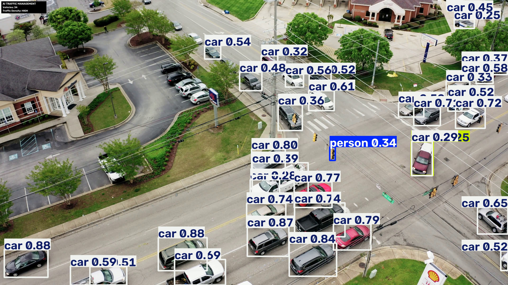

# AI Traffic Management System

## Project Overview

The AI Traffic Management System is a computer vision project that uses YOLO11 object detection to detect and visualize vehicles in traffic video footage.

The system processes a traffic video frame by frame and identifies objects using a YOLO model.

## Objectives

- Detect vehicles in traffic videos using AI.
- Apply object detection using YOLO.
- Process traffic footage frame by frame.
- Generate an annotated output video.
- Demonstrate the use of computer vision for intelligent traffic monitoring.

## Technologies Used

- Python
- YOLO11
- Ultralytics
- OpenCV
- Google Colab
- Computer Vision

## Project Structure

```text
AI_Traffic_Management_Project/
|
|-- yolo11n.pt
|-- detect.py
|-- requirements.txt
|-- README.md
|
|-- input/
|   |-- Traffic_video (2).mp4
|
|-- output/
|   |-- final_traffic_result_h264.mp4
|
|-- screenshots/
```

## How It Works

1. The input traffic video is loaded using OpenCV.
2. The YOLO model analyzes each video frame.
3. Objects are detected in each frame.
4. Bounding boxes and labels are generated.
5. The processed frames are combined into an output video.
6. The final annotated video is saved in the output folder.

## Installation

Install the required libraries:

```bash
pip install -r requirements.txt
```

## Running the Project

Run the detection program:

```bash
python detect.py
```

The processed video will be generated inside the output folder.

## Results

The system successfully processes traffic video footage and generates an annotated video containing detected objects with bounding boxes and class labels.

## Future Improvements

- Vehicle counting
- Traffic density estimation
- Automatic congestion detection
- Traffic signal optimization
- Number plate recognition
- Emergency vehicle detection
- Real-time CCTV camera integration
- Accident detection
- Traffic analytics dashboard

## Project Type

Academic / Computer Vision / Artificial Intelligence Project

## License

This project is intended for educational and academic purposes.


## 🖼️ Traffic Management Results

The system detects vehicles and displays the current vehicle count and estimated traffic density directly on the processed video.

### Result 1



### Result 2


### Result 3


## 🎥 Output Video

The final processed video is available at:

`output/traffic_management_result_h264.mp4`

The output demonstrates YOLO-based vehicle detection, vehicle counting, and traffic-density estimation.

## Download YOLO11 Model

The model file is not included in this repository.

Download it automatically:

```python
from ultralytics import YOLO
model = YOLO("yolo11n.pt")

## Resources

- YOLO11 Model: [https://drive.google.com/file/d/1wcihyPHsyenmoaYFoznoniF190QCKco-/view?usp=drive_link]
